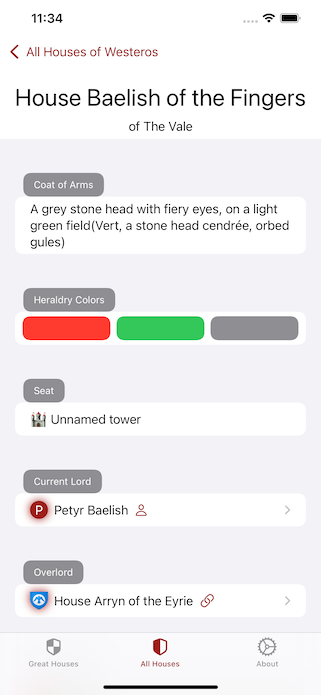
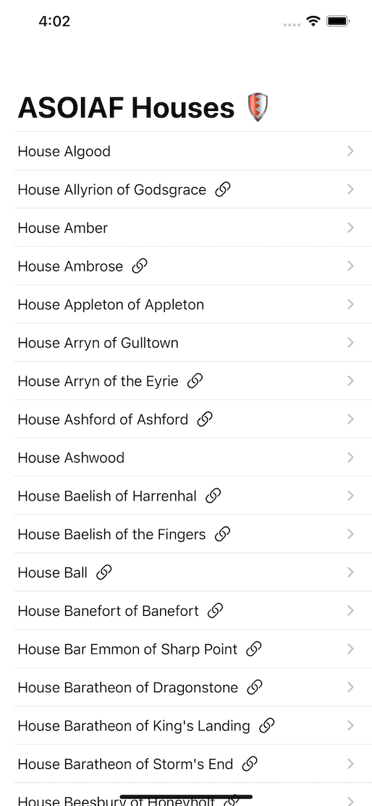

# SwiftUI Api Of Ice And Fire

  

A SwiftUI-App that lists the houses in A Song of Ice and Fire, taken from the [API of Ice And Fire](https://anapioficeandfire.com/).

Created by Matthias Zarzecki, 2021-01
