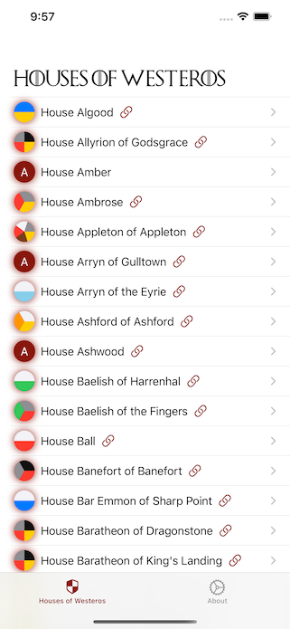
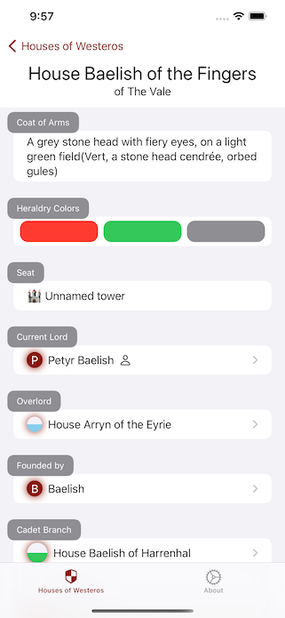

# SwiftUI Api Of Ice And Fire

   

[Bitrise Status](https://app.bitrise.io/app/57b166dbdbdcc89e.svg?token=9mGkAjqnQWrlMfogrUm-aA)

A SwiftUI-App that lists the houses in A Song of Ice and Fire, taken from the [API of Ice And Fire](https://anapioficeandfire.com/).

Created by Matthias Zarzecki, 2021-01
