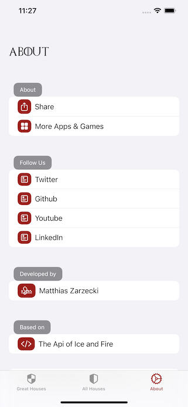
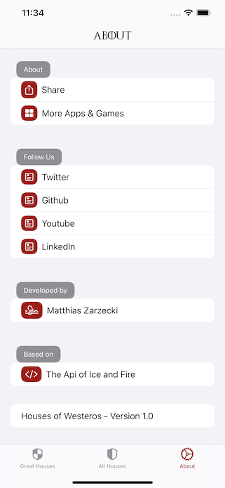
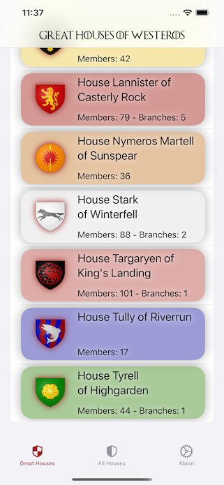

# SwiftUI Api Of Ice And Fire

     

A SwiftUI-App that lists the houses in A Song of Ice and Fire, taken from the [API of Ice And Fire](https://anapioficeandfire.com/).

Todo:
- Fix occasional iOS 15 Loading-bug in All Houses View
- Nicer Widgets
- Open House-page on tap on widget
- Timeout on Main Screen
- Tap tabbar icons to reset view
- More Unit-Tests
- More Unit-tests for ViewModels

Contains:
- Widgets
- SwiftUI
- Combine-Subscriptions
- Native API Calls with generic types 
- Pagination
- Nested API-Calls
- Graceful Failure - elements that do not exist (yet) are not shown instead of showing empty elements or errors
- MVVM Architecture
- Detailed House-View
- Detailed Character-View
- List of all Houses
- Elegant in-view error-handling on SingleHouse and Character Views (no popups!)
- Continuous Integration with BitRise
- Unit-Tests
- Extensive, detailed comments
- Custom color-parser to create icons per house from text-only description of the Coat of Arms
- Small Screen Support
- Extensive SwiftUI Previews
- Skeleton Loading Views
- Major Houses Display

Nice to Have:
- CodeCov integration in CICD
- Unit-Testing Views with ViewInspector Plugin
- Monkey-Tests
- Fetch nested data for Characters
- UI-Tests
- Actor Images through a movie api
- Dark Color Scheme & scheme switching
- Automated tests for error-handling
- Replace generic native calls with combine-subscriptions
- RealmDB Caching
- Welcome Tab with House of the Day View

Created by Matthias Zarzecki, 2021-01

# Attribution
- Images for Great Houses taken from the Wiki of Ice and Fire using CC-BY-SA 3.0 License.
- Dragon Icon created by Ramy Wafaa.
